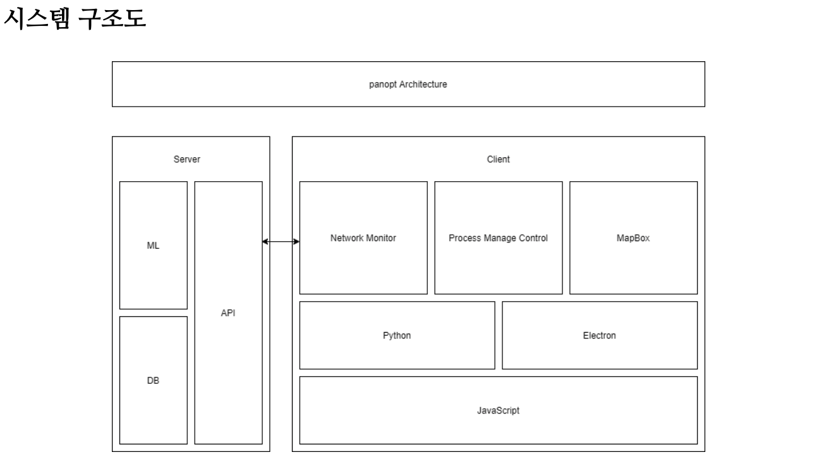
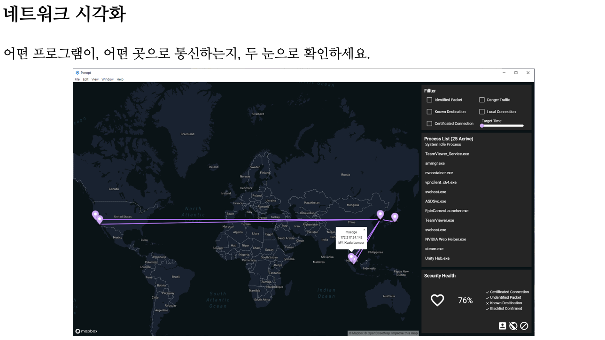
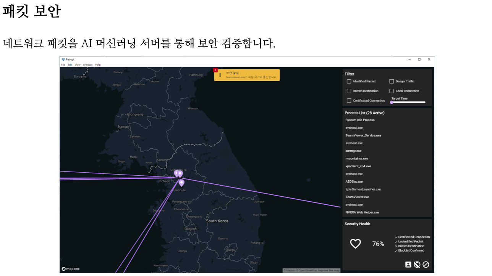
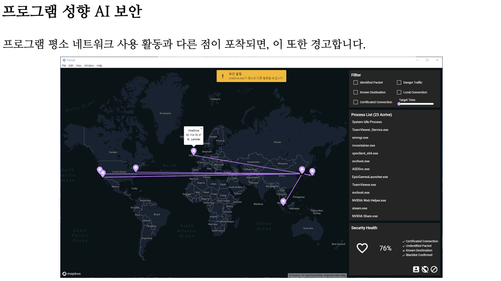
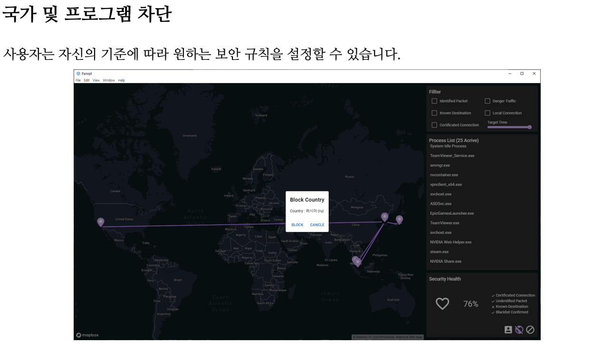

<h1 align="center">
  
PANOPT

</h1>

    
    
    

AI를 사용한 PC 네트워크 감시 및 토폴로지 가시화 시스템  
PC Network monitoring and topology visualization system with AI technology

## About

Panopt는 시용자와 프로세스의 네트워크 사용 패턴을 통해  
대용량 트래픽에서 이상 여부를 탐지하는 AI 기반의 네트워크 이상 탐지 프로그램입니다.  
증가하는 네트워크 침해 사고에 대해 적은 비용과 높은 정확도로 위협을 탐지합니다.  

## Documents

System Architecture

## Screenshots

## Tech Stacks

Web Frontend
* [Vue.js](https://github.com/vuejs/vue)
* [Electron](https://www.electronjs.org/)

Window Client
* [Python](https://www.python.org/)

Backend Server
* [Python](https://www.phtyon.org/)

## Participants

### [Moon Juhan](https://github.com/MoonJuhan)

Frontend Developer

### [Plumit](https://github.com/rct3232)

Window Client Developer

### [LimeCake](https://github.com/LimeCake)

Backend Developer

### [Seongbum Seo](https://github.com/Seongbuming)

AI Developer